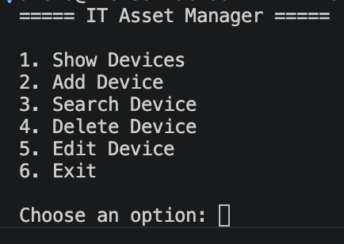
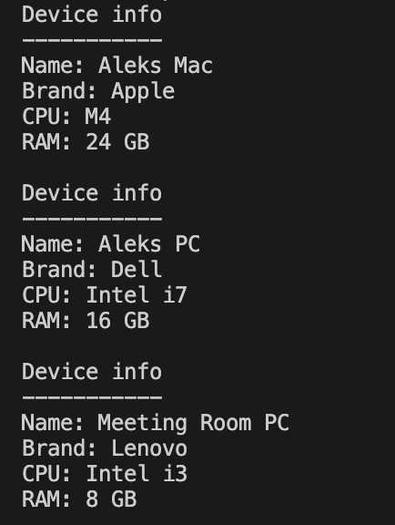
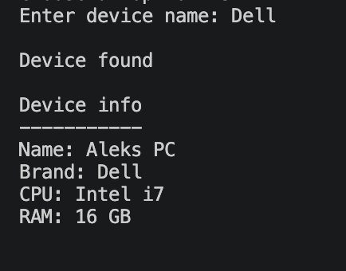

# IT Asset Manager

A command-line Python application for managing IT assets. This project was built to practise object-oriented programming (OOP), file handling and Python fundamentals while developing a complete CRUD application.

## Version

Current release: **v1.0.0**

## Features

- Add new devices
- View all devices
- Search devices by name or brand
- Edit existing devices
- Delete devices
- Sort devices by:
  - Name
  - Brand
  - CPU
  - RAM
- Save and load devices from a text file
- Input validation for user entries

## Technologies Used

- Python 3
- Object-Oriented Programming (OOP)
- Git
- GitHub
- VS Code

## What I Learned

This project helped me develop practical Python skills, including:

- Creating and working with classes and objects
- Organising code into multiple modules
- Reading from and writing to files
- Exception handling with `try` and `except`
- Sorting and searching data
- Refactoring code to improve readability
- Using Git and GitHub for version control

## Screenshots

### Main Menu

### Device List

### Search Example

## Future Improvements

Ideas for future versions:

- Export inventory to CSV
- Support additional device types
- Improve the user interface
- Store data in a database instead of a text file

## Author

Aleks Novozilovs